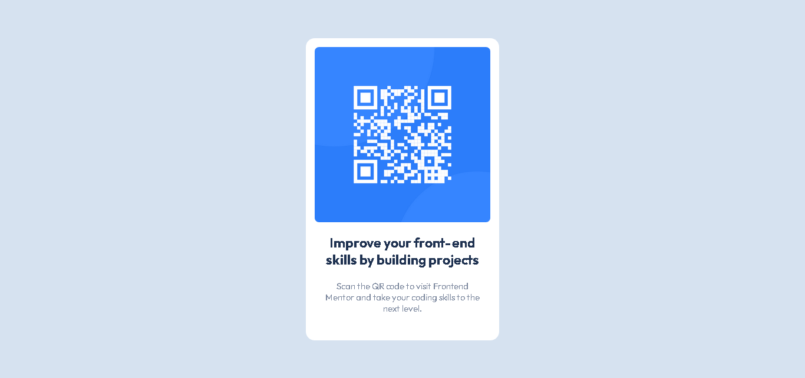

# qr-code-component
Project solution for QR code component challenge in frontendmentor.io
This is a solution to the [QR code component challenge on Frontend Mentor](https://www.frontendmentor.io/challenges/qr-code-component-iux_sIO_H).

## Table of contents
- [Overview](#overview)
  - [The challenge](#the-challenge)
  - [Screenshot](#screenshot)
  - [Links](#links)
- [My process](#my-process)
  - [Built with](#built-with)
  - [What I learned](#what-i-learned)
  - [Useful resources](#useful-resources)
- [About me](#about-me)

## Overview

### The challenge
For this challenge the users should be able to: 
- View the optimal layout depending on their device's screen size.
- See the same page of a QR code component, as the design.

### Screenshot

### Links
- Solution URL: 
- Live site URL: 

## My process

###Built with
- Semantic HTML5 markup
- CSS custom properties
- Flexbox

### What I learned
I learned a lot about the responsive design in CSS with flexbox. It is important to say that in this project I just do the design without the mobile first method.

### Useful resources
- [MDN documentation](https://developer.mozilla.org/en-US/docs/Web/CSS)
- [Free Code Camp](https://www.youtube.com/watch?v=XqFR2lqBYPs)
- [SoloLearn](https://www.sololearn.com/)

## About me
- Portfolio: [Stiven Ojeda](https://stibojeda.github.io)
- Linkedin: [Stiven Ojeda](https://www.linkedin.com/in/stiven-ojeda-090a3924a)
